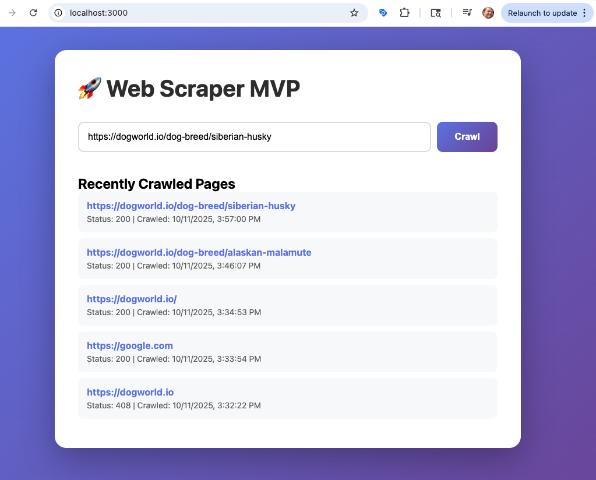

## Intro

This is an Express NodeJS web scraper that uses the Firecrawl API to crawl a website and store the results in a local Postgres database. The goal is to provide a way to crawl a website and store the results for later use. The UI is simple, with just an input of a URL and a button to crawl. However, you can check the schema files within the `migrations` folder to see the full data model, which is designed to support a fully featured, production level web scraping platform, which you can extend for your particular use case.

## Setup

1. Clone the repository
2. Install dependencies with `npm install`
3. Create a `.env` file in the root directory and add the following (you'll need a firecrawl api key):
   ```
   PORT=3000
   DATABASE_URL=postgresql://localhost:5432/web_scraper
   FIRECRAWL_API_URL=https://api.firecrawl.dev/v1/scrape
   FIRECRAWL_API_KEY=your_firecrawl_api_key
   ```
4. Create local Postgres database with `createdb web_scraper` (if this fails, reference Setup Troubleshooting below)
5. Start the server with `npm run dev`



## Setup Troubleshooting / Extra Details

1. Make sure you have a local instance of postgress running. You can try connecting with `psql postgres`
2. If you don't have postgres installed, you can install it with `brew install postgresql` then make sure it is running
3. If it's not running, you can start it with `brew services start postgresql`
4. Afer creating your local postgres database, you can connect to it with `psql web_scraper` and you should see it listed when you run `psql -l` in your terminal

## Tech Stack (MVP Focus)

- **Node.js/TypeScript** - Main application
- **PostgreSQL** - Storage
- **Firecrawl API** - External crawling service
- **Express** - REST API endpoints
